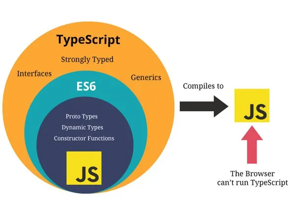

This is my **third** blog post using *markdown*.

### My subheading for the third blog

In this post, I want to share my insights into TypeScript and its role in building robust and scalable web applications.

See Image Below:



## TypeScript Magic

TypeScript is a superset of JavaScript that adds static typing to the language, making it more reliable and maintainable. Let's take a look at a simple TypeScript code snippet to illustrate:

```typescript
type GreetFunction = (name: string) => string;

const greet: GreetFunction = (name) => {
  return `Hello, ${name}! Welcome to the world of TypeScript.`;
};

const output: string = greet('Ajinkya');
console.log(output);
```

Output: Hello, Ajinkya! Welcome to the world of TypeScript.

