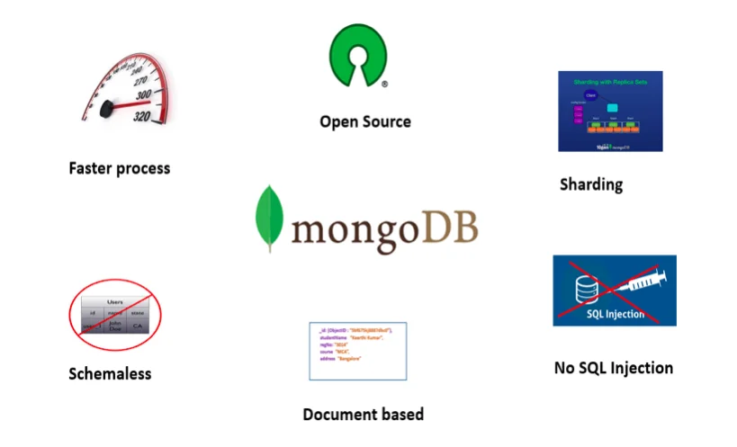

This is my **sixth** blog post using *markdown*.

### My subheading for the sixth blog

In this post, I want to share my insights into MongoDB and its role in building NoSQL databases for web applications.

See Image Below:



## MongoDB Magic

MongoDB is a popular NoSQL database that stores data in flexible, JSON-like documents. Let's take a look at a simple MongoDB query to illustrate:

```mongodb
// Example MongoDB Query
db.users.find({ age: { $gt: 25 } });
```