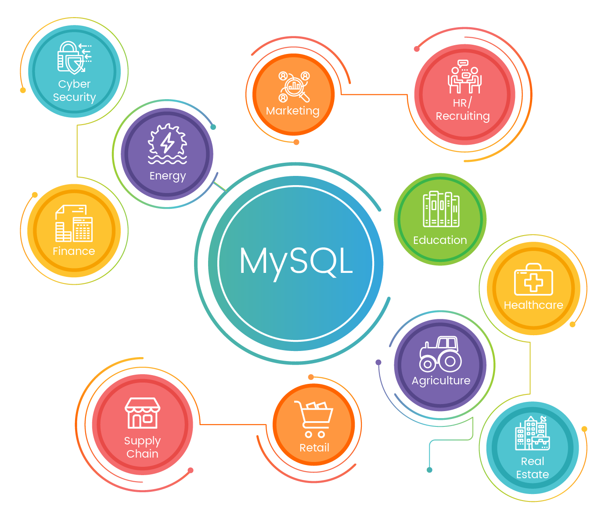

This is my **fifth** blog post using *markdown*.

### My subheading for the fifth blog

In this post, I want to share my insights into MySQL and its role in building relational databases for web applications.

See Image Below:



## MySQL Magic

MySQL is a popular relational database management system used to store and retrieve data. Let's take a look at a simple MySQL query to illustrate:

```sql
-- Example SQL Query
SELECT * FROM users WHERE age > 25;
```
