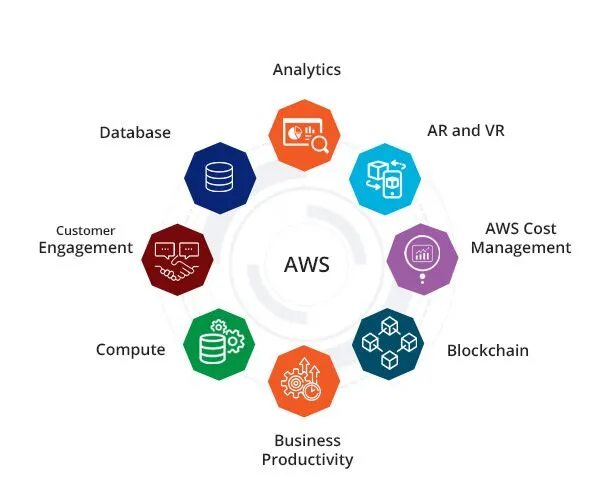

## AWS (Amazon Web Services) Essentials

AWS is a comprehensive cloud services platform provided by Amazon.

### Launching an EC2 Instance

Walk through the steps of launching an EC2 instance on AWS.

### Core AWS Services

- S3 (Simple Storage Service)
- Lambda
- DynamoDB
