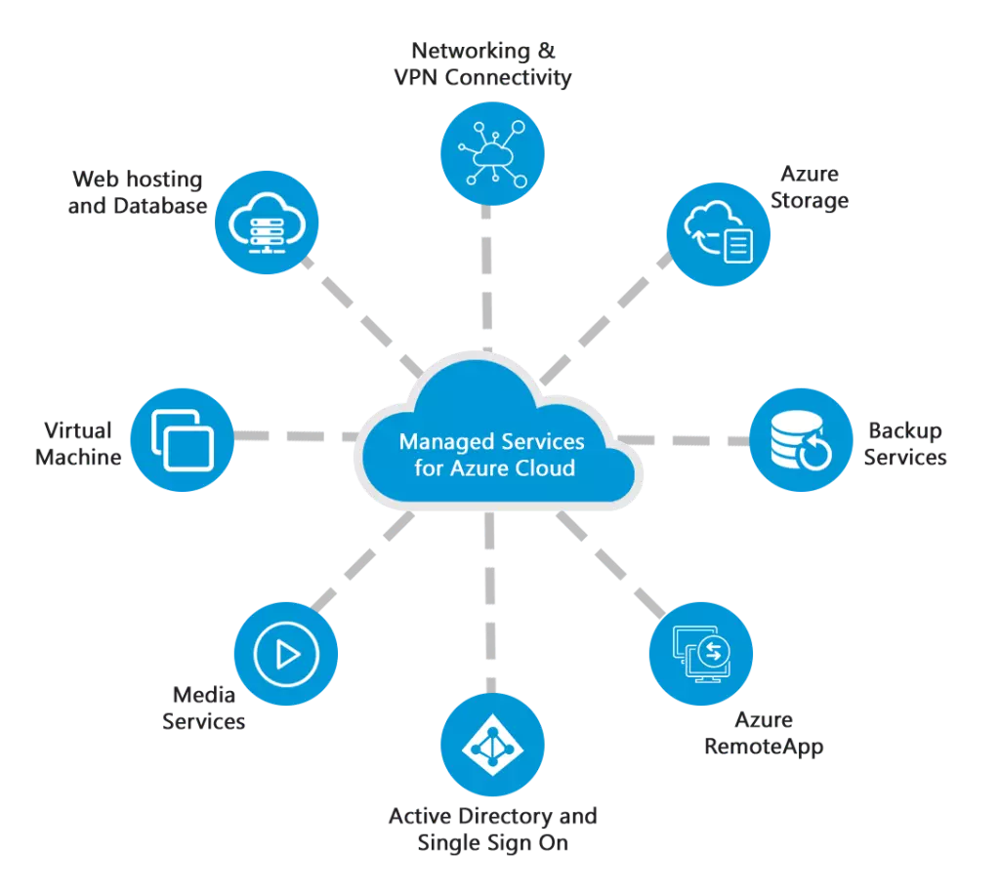

## Overview of Microsoft Azure

Microsoft Azure is a cloud computing platform offering a wide range of services for building, deploying, and managing applications.

### Creating an Azure Virtual Machine

Explore the Azure portal to provision a virtual machine.

### Key Azure Services

- Azure App Service
- Azure SQL Database
- Azure Functions