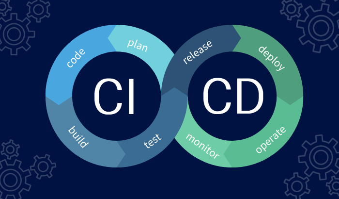

## Understanding CI/CD

CI/CD (Continuous Integration/Continuous Deployment) practices aim to automate the software delivery process, ensuring reliability and speed.

### CI/CD Pipeline Example

Describe a sample CI/CD pipeline using popular tools like Jenkins or GitLab CI.

### Benefits of CI/CD

- Faster release cycles
- Early bug detection
- Consistent deployments
