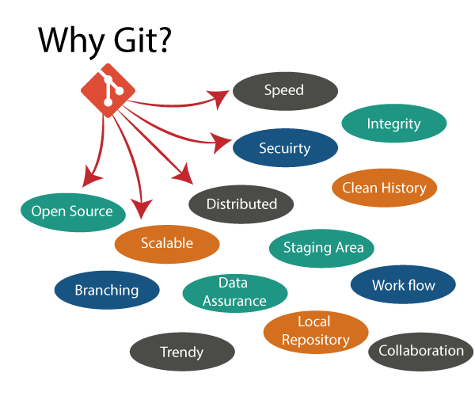

## GitHub Basics

GitHub is a web-based platform for version control and collaborative software development.

### Creating a Repository

Walkthrough the process of creating a new repository on GitHub.

### GitHub Features

- Pull Requests
- Issues
- Actions
