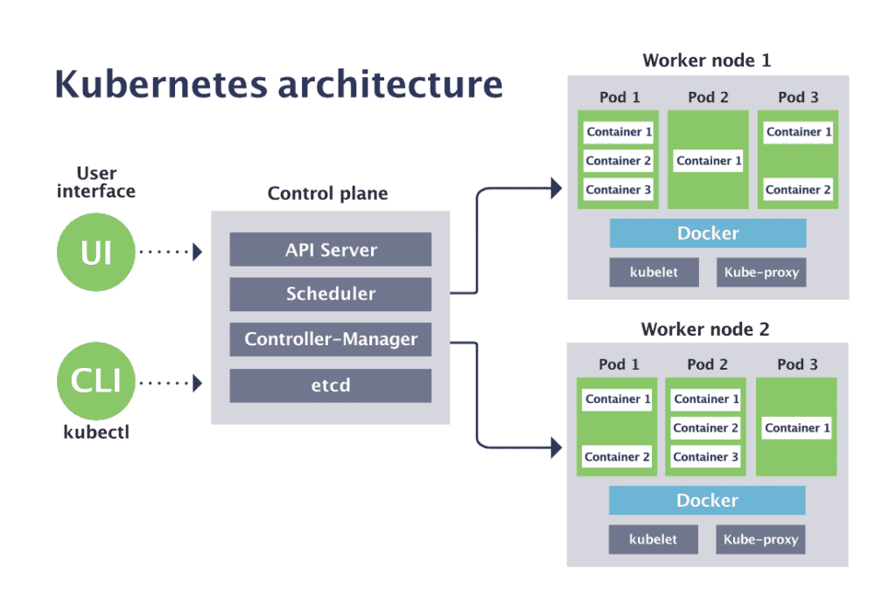
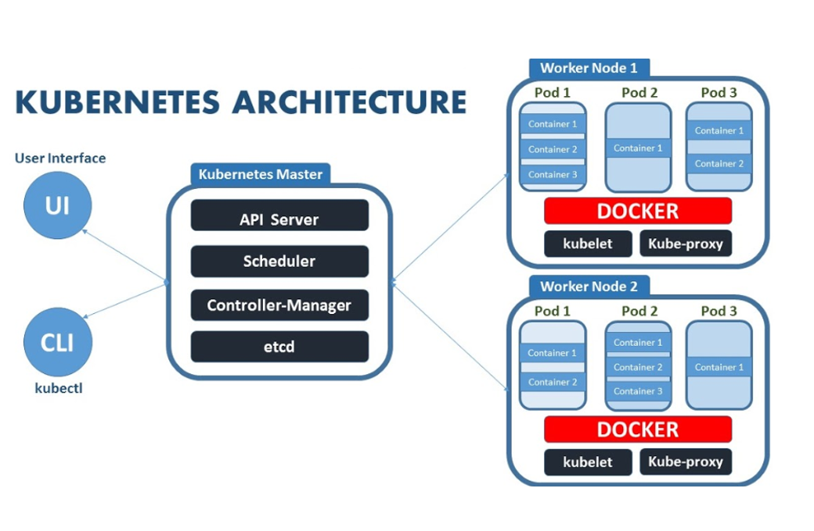

## Introduction to Kubernetes

Kubernetes is an open-source container orchestration platform for automating deployment, scaling, and management of containerized applications.

### Deploying a Service on Kubernetes

Explore a simple Kubernetes deployment manifest.

### Key Kubernetes Concepts

- Pods
- Services
- Deployments

### Kubernetes Architecture

