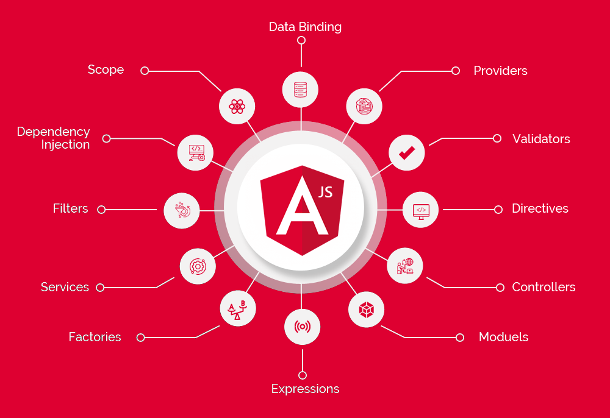

In this post, I want to share my insights into Angular and its role in building robust and scalable web applications.

See Image Below:




## Angular Magic

Angular is a powerful front-end framework that enables the development of dynamic and feature-rich web applications. Let's take a look at a simple Angular code snippet to illustrate:

```ang
// app.component.ts
import { Component } from '@angular/core';

@Component({
  selector: 'app-root',
  template: '<p>{{ greet("Ajinkya") }}</p>',
})
export class AppComponent {
  greet(name: string): string {
    return `Hello, ${name}! Welcome to the world of Angular.`;
  }
}
```

Output:

```ang
Hello, Ajinkya! Welcome to the world of Angular.
```
