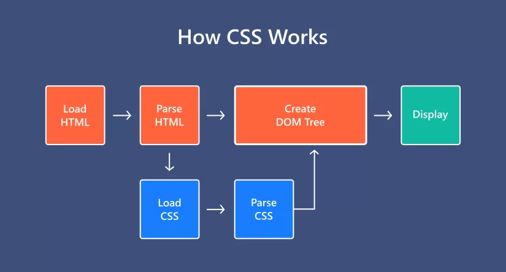

CSS stands for Cascading Style Sheets. It is a stylesheet language that is used to describe the visual presentation of a web page written in HTML (Hypertext Markup Language).

HTML creates the structure of the page, while CSS adds styling to that structure. This tutorial assumes that you have prior knowledge of HTML.

## Why the Word "Cascade"?

The term "cascade" refers to the priority scheme determining which CSS rules are applied when multiple rules target an element. This scheme takes into account specificity and inheritance, ensuring that the most specific and latest rules are applied.

## Why Use CSS?

CSS is used to provide styling to HTML elements, making web pages visually appealing and user-friendly.




## Exploring CSS Styles

CSS (Cascading Style Sheets) is used for styling web pages. It allows you to control the layout and appearance of HTML elements.

### Styling with CSS

```css
/* CSS Styles */
body {
  font-family: 'Arial', sans-serif;
  background-color: #f0f0f0;
  color: #333;
}

h1 {
  color: #0066cc;
}

p {
  font-size: 16px;
  line-height: 1.5;
}
```

```css
/* Example of a CSS rule */
selector {
    property: value;
}
```