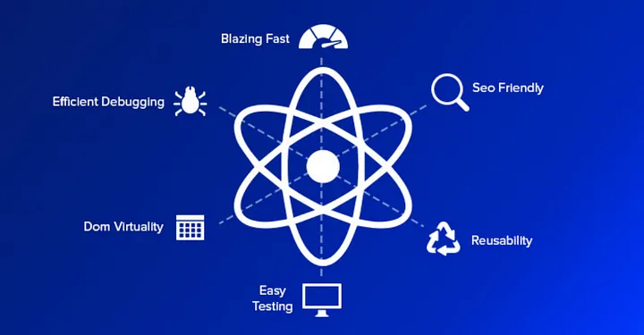
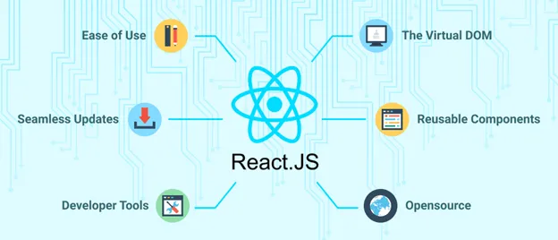

## Getting Started with React

I recently started exploring React, a powerful JavaScript library for building user interfaces. It offers a component-based architecture that allows for the creation of reusable UI elements.

ReactJS is a JavaScript library used to build User Interfaces (UI). It significantly decreases the code with its components, states i.e. hooks, etc.

## Creating a React App

Open your terminal in the directory you would like to create your application. Run this command to create a React application named `my-react-app`:

```bash
npx create-react-app my-react-app
```

OR, you can directly make your application without specifying a name, like this:
```bash
npx create-react-app .
```

In this case, all files will be kept in the current directory. 

Note: When choosing folder name, make sure there are no spaces or capital letters because of npm naming restrictions. 

Once base application is created, if folder specified you just have to enter the folder. You can use this command to enter:
```bash
cd directory-name
```

Then just start up the application with this command:
```bash
npm start
```
and you are good to go!

###Hello World
```react
const root = ReactDOM.createRoot(document.getElementById('root'));
root.render(<h1>Hello, world!</h1>);

```
In this we are just putting h1 tag in a div with id 'root'. That's it! In div with id 'root' everything will be rendered. We can also change it from 'root' to something else, as we are just getting an element and putting HTML in it. 

See Image Below:





### My First React Component

Let's take a look at a simple React component I created:

```jsx
import React from 'react';

export function MyComponent() {
  return (
    <p>This is my first React component!</p>
  );
}
```

Output: 
```react
This is my first React component!
```