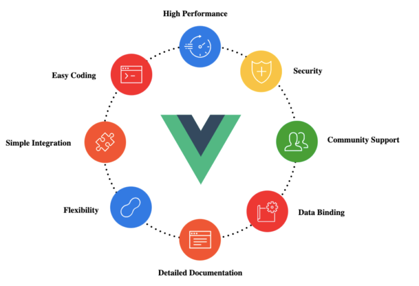

This is my **first** blog post using *markdown* and Vue.js.

## Getting Started with Vue.js



Vue.js is a progressive JavaScript framework used for building user interfaces. It is designed to be incrementally adaptable and can easily integrate into other projects.

### Vue Component Example

Let's take a look at a simple Vue component:

```vue
<template>
  <div>
    <h2>{{ greeting }}</h2>
    <p>{{ message }}</p>
  </div>
</template>

<script>
export default {
  data() {
    return {
      greeting: 'Hello, Vue!',
      message: 'This is my first Vue.js component.'
    };
  }
};
</script>
```